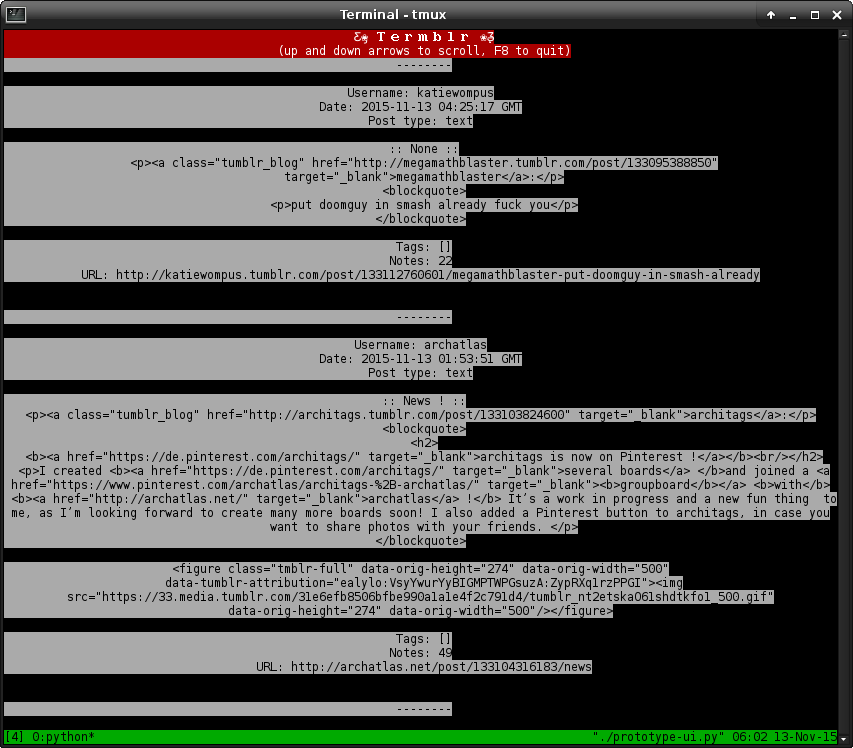

<!-- MarkdownTOC -->

- Termblr
    - Installation
    - Application Screenshot
    - Contributing

<!-- /MarkdownTOC -->
# Termblr
By Michael Sarfati (michael.sarfati@utoronto.ca), 2015

## Installation
### Make Virtual Environment
```bash
mkvirtualenv -p `which python3` -a . Termblr
```
```bash
make install
```

## Application Screenshot
### Termblr on 2015-11-13


## Contributing
### Our Toolchain
* [Py3Tumblr](https://github.com/dianakhuang/pytumblr/tree/diana/python-3-support) - Tumblr API wrapper compatible for Python 3
* [ObjectPath](https://pypi.python.org/pypi/objectpath/) - a specification for sanely querying JSON and Python objects
    - [ObjectPath](https://github.com/adriank/ObjectPath) Python library
* [urwid](http://urwid.org/) - Console interface toolkit
* [Requests](http://docs.python-requests.org/en/latest/) - handles other web requests
* [lxml](http://lxml.de/) - For the occasional scraping

### Tools still requiring research
* Rendering images into ANSI/ASCII art
* Rendering videos into ANSI/ASCII
* Render audio into 8bit
